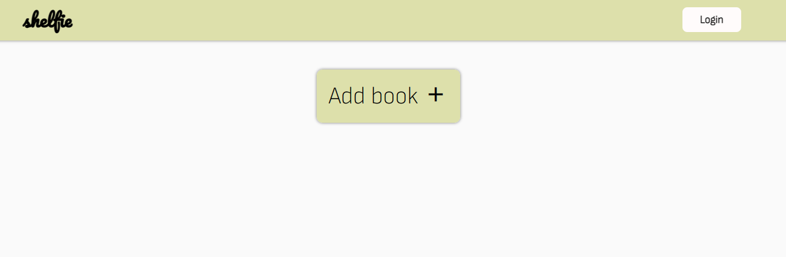

# Shelfie Library

This Library web app allows you to easily store and organize your collection of books, whether you've read them or not. It serves as a convenient storage solution for your personal library.

## Getting started

These instructions will get you a copy of the project up and running on your local machine for development and testing purposes.

## Prerequisite

- Web Browser

## Installing

1. Clone the repo
   `git clone https://github.com/BenedictaUche/odinproject.git`
2. Open index.html in your web browser or run using Live server

## Usage

1. Click on the `Add Book` button located at the top of the page.
2. Fill out the form with the necessary information about the book you want to add.
3. Click the Submit button and your book will be stored in the library.

That's it! You can now view your added book in the library and keep track of your reading progress.
